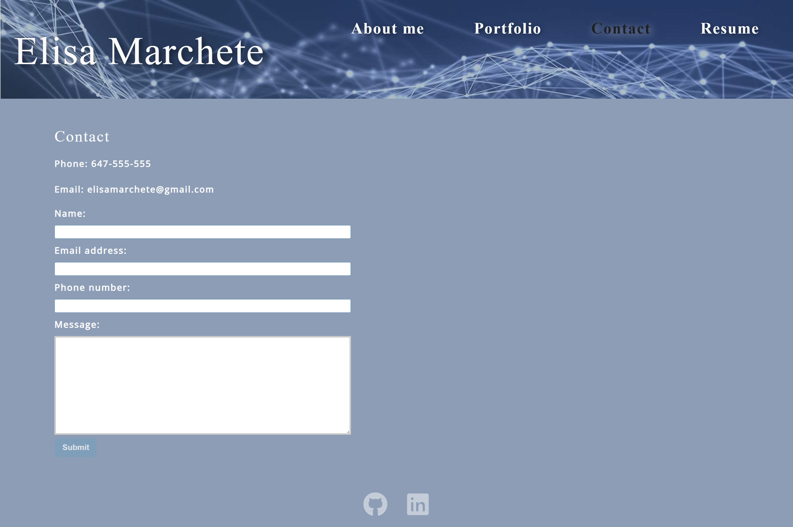

# React Portfolio

## Description

This is a professional portfolio website built using React. It showcases my projects, and experiences in web development. The portfolio is designed to provide potential employers or clients with a comprehensive overview of my abilities and previous work.

## Live Demo

You can check out the live version of the portfolio at [https://elisamarchete.github.io/react-portfolio/](https://elisamarchete.github.io/react-portfolio/)

## Table of Contents

- [Features](#features)
- [Usage](#usage)
- [License](#license)
- [Screensho and URL of the deployed application](#screenshot-and-url-of-the-deployed-application)

## Features

- About Me: A brief introduction and summary of my skills, passions, and goals.
- Portfolio: Showcase of my completed and ongoing projects with descriptions and live/demo links.
- Contact: Form to send me a message and email address.
- Resume: A downloadable PDF of my resume.
- Footer: Links to my GitHub, and LinkedIn profiles.

## Usage

The portfolio is designed to be easy to navigate and provide a comprehensive overview of my abilities and previous work. It is also designed to be responsive and accessible on a range of devices, making it easy to view and navigate for potential employers or clients.
To access the portfolio, simply click on the link above in the live demo section.

## License

This project is licensed under the MIT license.

## Screenshot and URL of the deployed application

[Link deployed application](https://elisamarchete.github.io/react-portfolio/)
